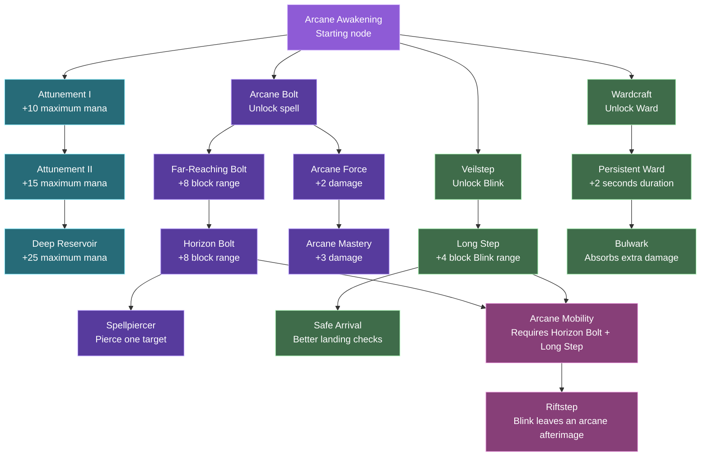

# Arcana Skill Tree Design

This is the proposed first usable skill tree. Nodes cost one skill point unless noted otherwise. A node can only be purchased when its prerequisite is unlocked.

## In-game presentation

- The tree opens with **K**.
- Locked nodes are dimmed and show their prerequisite.
- Available nodes glow when the player has a skill point.
- Purchased nodes use the school color and show their current rank.
- Cross-branch nodes use a distinct hybrid color.
- The first implementation should expose the Arcane Bolt range node, then add the remaining nodes incrementally.

## Implementation order

1. Add node definitions and prerequisite validation.
2. Sync skill points and unlocked nodes to the client.
3. Render the tree with pan/zoom-friendly spacing.
4. Add node purchase packets with server validation.
5. Connect mana, Bolt, Blink, and Ward upgrades.
